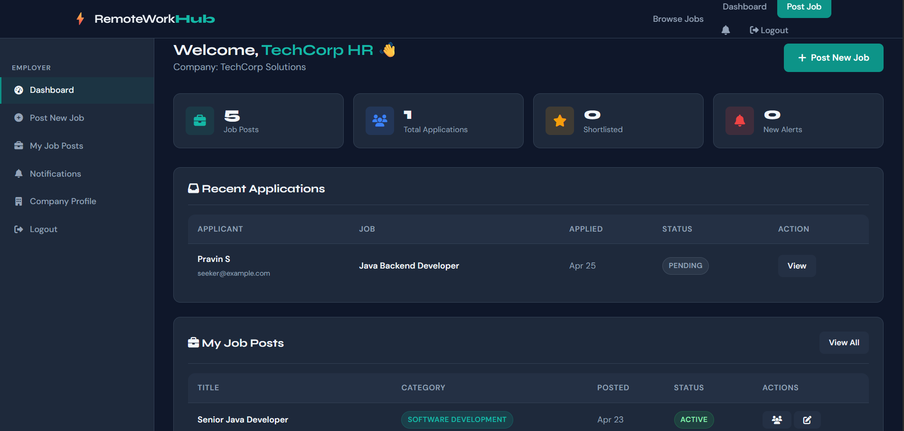
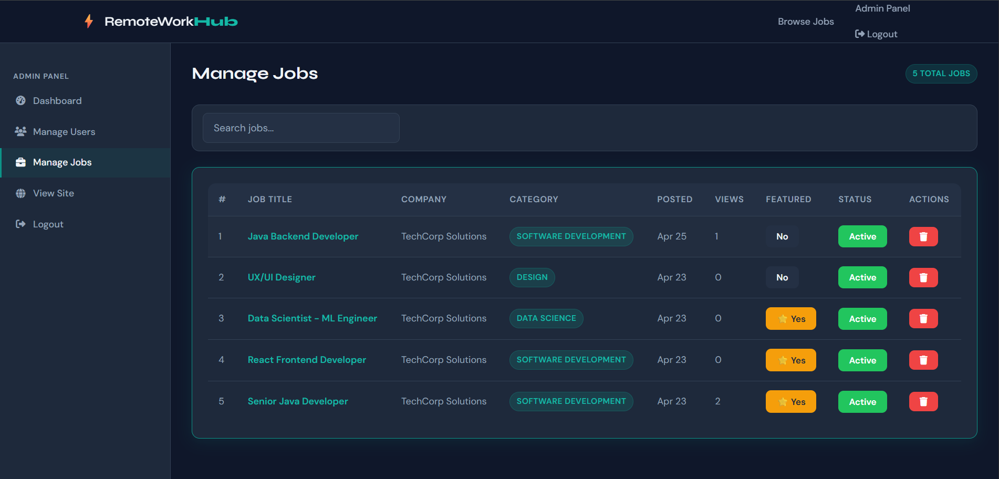
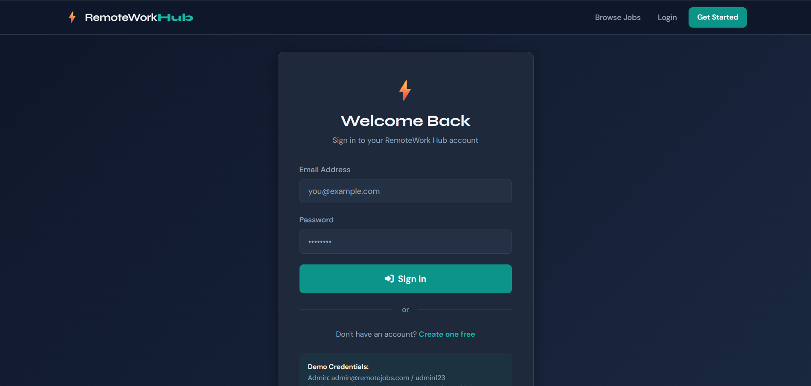

🌐 Remote Jobs Portal

I developed this full-stack Remote Jobs Portal to enable job seekers to find remote opportunities and employers to post and manage job listings efficiently.

## 🚀 Features
- User registration and login
- Employers can post job listings
- Job seekers can apply for jobs
- Filter jobs by role/location

## 🛠 Tech Stack
- Backend: Spring Boot
- Frontend: HTML, CSS, JavaScript
- Database: MySQL
- Build Tool: Maven

## 🗄 Database
- MySQL

### Tables
- users
- jobs
- applications

## 🔗 API Endpoints

| Method | Endpoint     | Description       |
|--------|-------------|------------------|
| GET    | /api/jobs   | Get all jobs     |
| POST   | /api/jobs   | Create job       |
| POST   | /api/login  | User login       |

## 📂 Project Structure
remote-jobs-portal/
│── mobile-app/
│── remotejobs/
│── src/
│── README.md

## 📸 Screenshots

## 📚 What I Learned
- REST API development
- MVC architecture
- Database integration with Spring Boot

## ▶️ How to Run
1. Clone the repository
2. Open backend (remotejobs) in IntelliJ
3. Run Spring Boot application
4. Open browser at http://localhost:8080

## 👨‍💻 Author
- Pravin
- GitHub: https://github.com/pravin200606-cmyk
